# Modos de Execucao - Diagramas

## Visao Geral: Todos os Modos

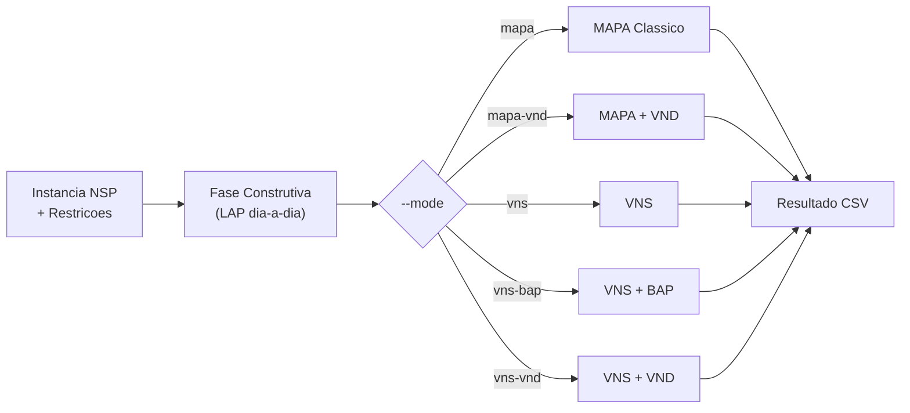

## Fase Construtiva (Comum a Todos)

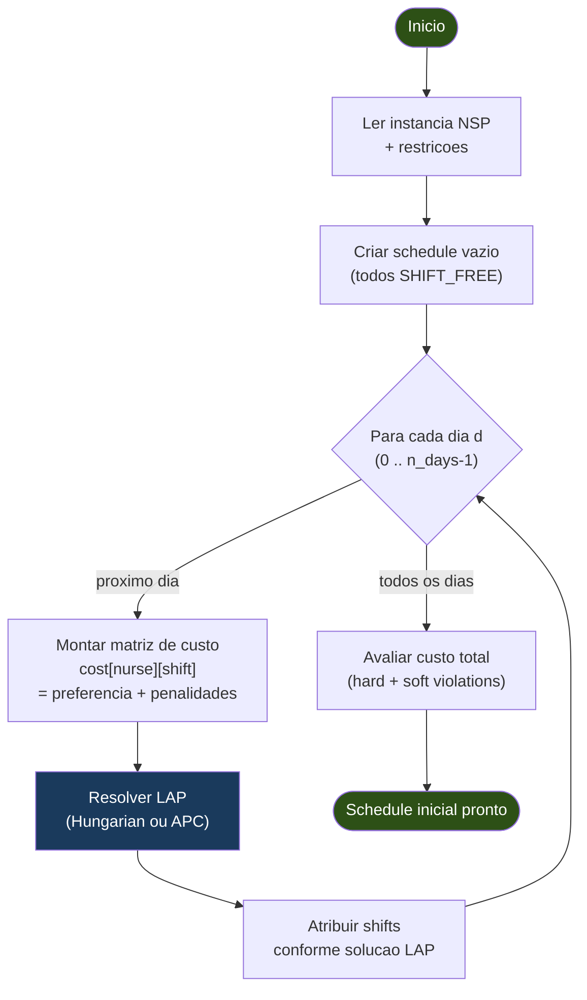

## Modo 1: `mapa` - MAPA Classico

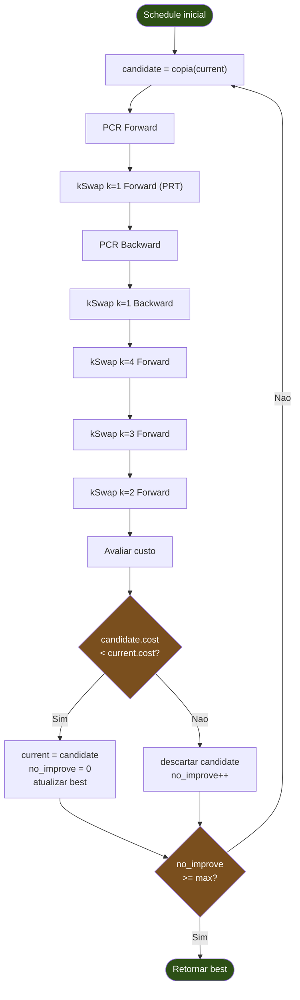

## Modo 2: `mapa-vnd` - MAPA com VND

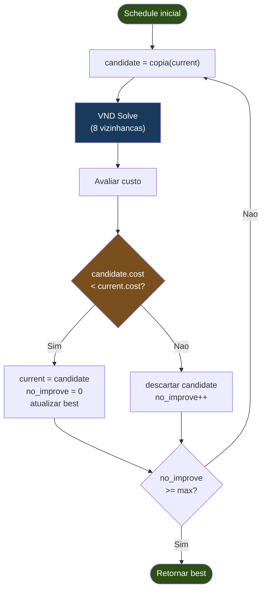

## Motor VND (usado por `mapa-vnd` e `vns-vnd`)

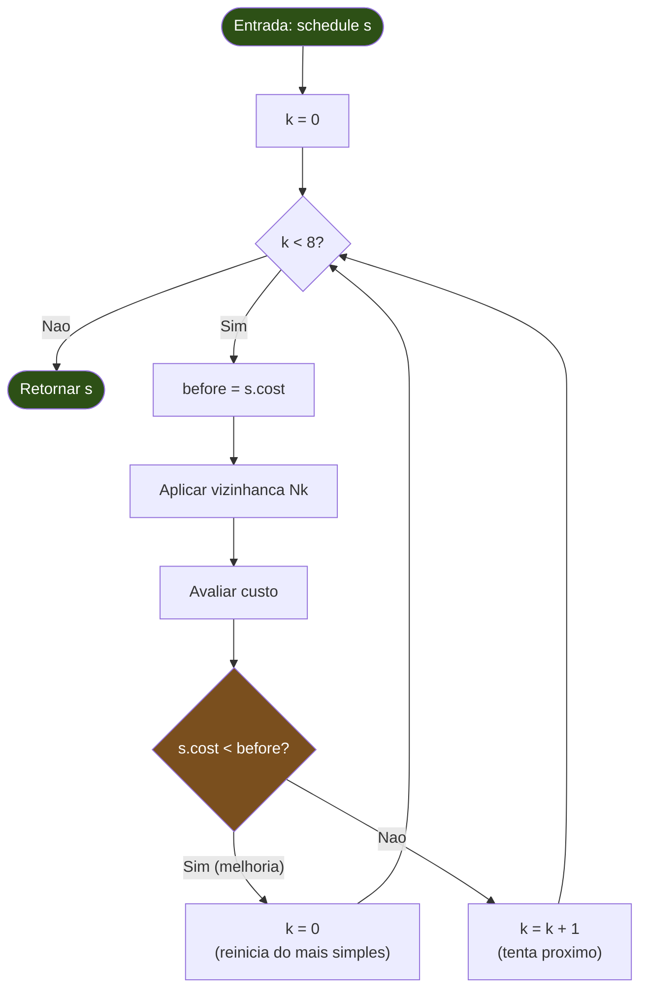

### Vizinhancas VND em Ordem

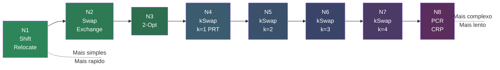

## Modo 3: `vns` - VNS Metaheuristica

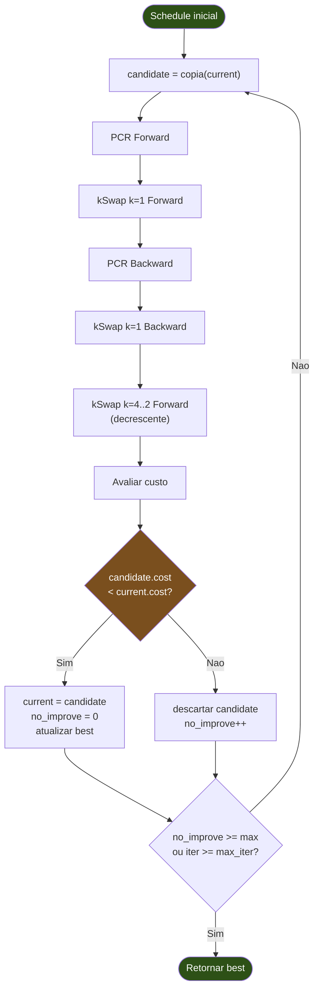

## Modo 4: `vns-bap` - VNS com Solver BAP

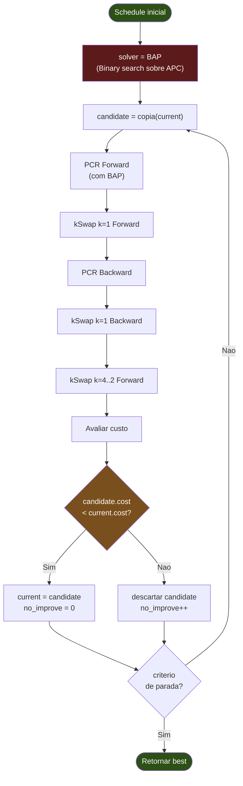

### Diferenca: APC vs BAP

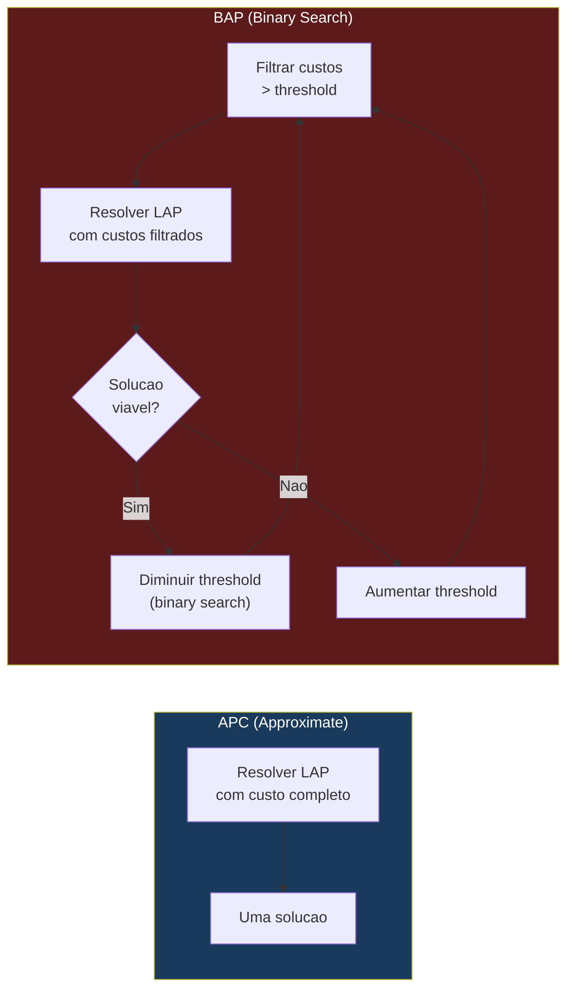

## Modo 5: `vns-vnd` - VNS com Shaking + VND

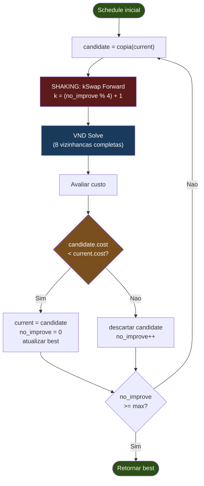

### Ciclo Shaking do VNS-VND

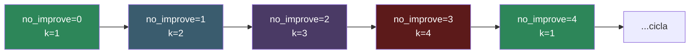

## Comparacao entre Modos

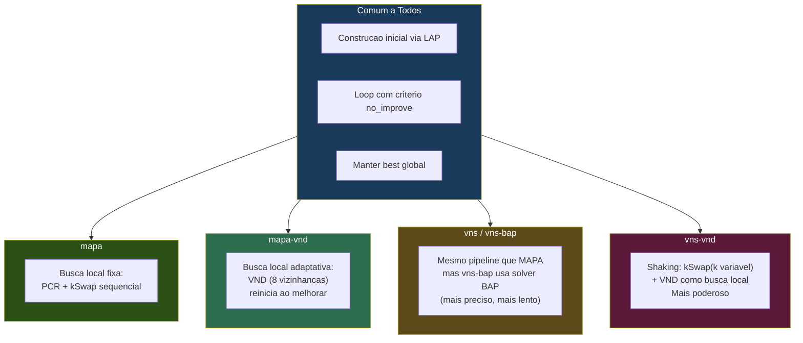
